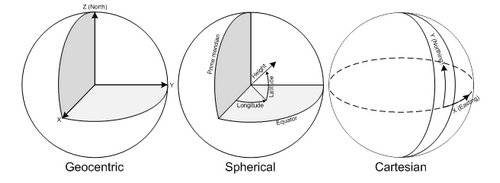

[reference](https://malagis.com/coordinate-coordinate-reference-coordinate-transformation-projection-transformation.html)

# 关于坐标系、坐标参照系、坐标变换、投影变换
 

## 1. 坐标系（coordinate system、CS）
由两个、三个甚至更多个坐标轴，单位标度等组成，使得可利用数学法则计算距离、角度或其他几何元素。如坐标轴相互垂直的笛卡尔（Cartesian）坐标系；坐标轴不必相互垂直的仿射（affine）坐标系；用经纬度、高程来确定点位置的椭球面（ellipsoidal）坐标系等。

## 2. 坐标参照系（coordinate reference system、CRS）
通过基准面（datum）与真实世界或者说地球相关联的坐标系即坐标参照系。基准面是椭球体用来逼近某地区用的，因此各个国家都有各自的基准面。我们常用的基准面有：BEIJING1954，XIAN1980，WGS1984等。尽管两者有所不同.

## 3. 地心坐标系（geocentric cs、GEOCCS）
以地球中心为原点，直接用X、Y、Z来进行位置的描述，无需模拟地球球面，常用在GPS中。

## 4. 地理坐标系（geographic cs、GEOGCS）
带Datum的椭球面坐标系，单位经度、纬度，高程用作第三维。参数：椭球体、基准面。

## 5. 投影坐标系（projected cs、PROJCS）
平面坐标系，单位米、英尺等，它用X(Easting)、Y(Northing)来描述地球上某个点的位置。它对应于某个地理坐标系，在UML中表示属于1对多的关系，1个地理坐标系经过不同的投影方式可产生多个投影坐标系。参数：地理坐标系、投影方式。

## 6. 地理变换
在地理坐标系之间的进行数据转换的方法，基准可能不同，有三参数和七参数法。