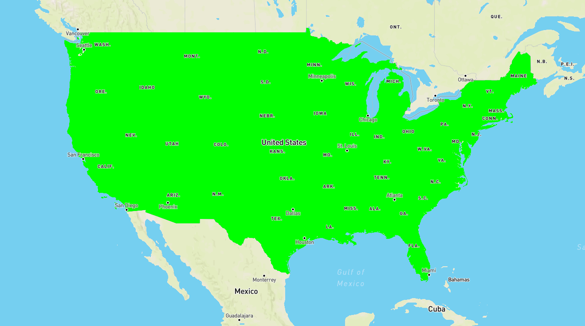

# GeoServer+mapbox发布矢量瓦片(一)--加载美国各州数据的shap切面
---
# 安装GeoServer
- 使用Geoserver： geoserver-2.15.0.exe版本 和对应的vector tiles 插件 
- 
- 参考：[GeoServer+Mapbox](https://www.jianshu.com/p/fae87fef8ad0)
# 配置Geoserver 数据
 - Data_dir中的 美国各个州的shp作为数据源

# 跨域问题：
- 跨域使用 jetty的两个jar文件： jetty-servlets-9.4.9.v20180320.jar jetty-util-9.4.9.v20180320.jar

- 设置web.xml 
  ```xml
            <filter>
                <filter-name>cross-origin</filter-name>
                <filter-class>org.mortbay.servlets.CrossOriginFilter</filter-class>
                <init-param>
                    <param-name>allowedOrigins</param-name>
                    <param-value>*</param-value>
                </init-param>
                <init-param>
                    <param-name>allowedMethods</param-name>
                    <param-value>GET,POST</param-value>
                </init-param>
                <init-param>
                    <param-name>allowedHeaders</param-name>
                    <param-value>x-requested-with,content-type</param-value>
                </init-param>
            </filter>

以及

```xml
        <filter-mapping>
            <filter-name>cross-origin</filter-name>
            <url-pattern>/*</url-pattern>
        </filter-mapping>
```

- 参考：[GeoServer跨域设置](https://blog.csdn.net/mengdong_zy/article/details/51784781)


# 编写mapbox 网页

```html
        <!DOCTYPE html>
        <html>
        <head>
            <meta charset='utf-8' />
            <title>Join local JSON data with vector tile geometries</title>
            <meta name='viewport' content='initial-scale=1,maximum-scale=1,user-scalable=no' />
            <!-- <script src='https://api.tiles.mapbox.com/mapbox-gl-js/v0.54.0/mapbox-gl.js'></script> -->
            <!-- <link href='https://api.tiles.mapbox.com/mapbox-gl-js/v0.54.0/mapbox-gl.css' rel='stylesheet' /> -->
            <script src='https://api.tiles.mapbox.com/mapbox-gl-js/v1.0.0/mapbox-gl.js'></script>
            <link href='https://api.tiles.mapbox.com/mapbox-gl-js/v1.0.0/mapbox-gl.css' rel='stylesheet' />
            <style>
                body { margin:0; padding:0; }
                #map { position:absolute; top:0; bottom:0; width:100%; }
            </style>
        </head>
        <body>
        <div id='map'>
        </div>
        <script>
            mapboxgl.accessToken ='pk.eyJ1IjoibG9uZ2xvbmd3YXl0b2dvIiwiYSI6ImNqdnZ6OWV6cTFnY240NG9nbmxnc2k5dTkifQ.hsbNl4QUNyn46nfbztiFpw';
            var map = new mapboxgl.Map({
                container: 'map', 
                style: 'mapbox://styles/mapbox/streets-v9', 
                center: [-99.637496,38.719526], 
                zoom: 4
            });
            map.on('load', function() {
                map.addSource('usa_states',{
                    'type':'vector',
                    'scheme':'tms',
                // 'tiles':['http://localhost:8080/geoserver/gwc/service/tms/1.0.0/myTest%3AbigBuildings@EPSG:900913@pbf/{z}/{x}/{y}.pbf']
                'tiles':['http://192.168.1.230:8080/geoserver/gwc/service/tms/1.0.0/mapbox%3Astates@EPSG%3A900913@pbf/{z}/{x}/{y}.pbf']
                });

                map.addLayer({
                'id':'states',
                'type':'fill',
                'source':'usa_states',
                'source-layer':'states',
                'paint':{
                    'fill-color':'#00ff00',
                    }
                },
                'waterway-label');
            });
        </script>
        </body>
        </html>

```

使用wmts 协议访问瓦片数据：
       map.addSource('usa_states', {
                'type': 'vector',
                'scheme': 'xyz',
                'tiles': ['http://192.168.1.230:8080/geoserver/gwc/service/wmts?REQUEST=GetTile&SERVICE=WMTS&VERSION=1.0.0&LAYER=mapbox:states&STYLE=&TILEMATRIX=EPSG:900913:{z}&TILEMATRIXSET=EPSG:900913&FORMAT=application/x-protobuf;type=mapbox-vector&TILECOL={x}&TILEROW={y}']  
            });
参考：[利用geoserver发布矢量切片，mapbox进行调用](https://blog.csdn.net/qq_24622397/article/details/78411587)
# 预览结果：

# 其他参考：
 [Publishing a GeoServer Layer for use with Mapbox Styles](https://docs.geoserver.org/latest/en/user/styling/mbstyle/source.html)


