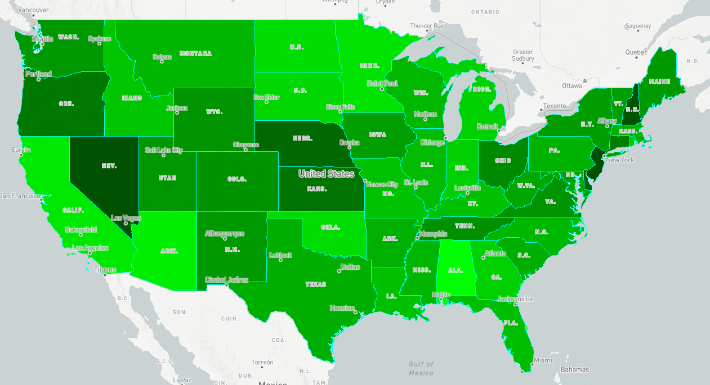

# GeoServer+mapbox发布矢量瓦片(二)：改进渲染风格

# 说明
 参考[Mapbox例子](https://docs.mapbox.com/mapbox-gl-js/example/data-join/)中显示美国每个州的分布图，读取GeoServer发布的切片。通过根据各州的code编码，设置颜色显示和边界线颜色，html代码如下：

 ```html
        

<!--https://docs.mapbox.com/mapbox-gl-js/example/data-join/-->

<!DOCTYPE html>
<html>

<head>
    <meta charset='utf-8' />
    <title>Join local JSON data with vector tile geometries</title>
    <meta name='viewport' content='initial-scale=1,maximum-scale=1,user-scalable=no' />
    <script src='https://api.tiles.mapbox.com/mapbox-gl-js/v1.0.0/mapbox-gl.js'></script>
    <link href='https://api.tiles.mapbox.com/mapbox-gl-js/v1.0.0/mapbox-gl.css' rel='stylesheet' />
    <style>
        body {
            margin: 0;
            padding: 0;
        }
        
        #map {
            position: absolute;
            top: 0;
            bottom: 0;
            width: 100%;
        }
    </style>
</head>

<body>


    <div id='map'>
    </div>
    <script>
        mapboxgl.accessToken = 'pk.eyJ1IjoibG9uZ2xvbmd3YXl0b2dvIiwiYSI6ImNqdnZ6OWV6cTFnY240NG9nbmxnc2k5dTkifQ.hsbNl4QUNyn46nfbztiFpw';
        var map = new mapboxgl.Map({
            container: 'map',
            style: 'mapbox://styles/mapbox/light-v10',
            center: [-99.9, 41.5],
            zoom: 1
        });

        // Join local JSON data with vector tile geometry
        // USA unemployment rate in 2009
        // Source https://data.bls.gov/timeseries/LNS14000000
        var maxValue = 13;
        var data = [{
            "STATE_FIPS": "01",
            "unemployment": 13.17
        }, {
            "STATE_FIPS": "02",
            "unemployment": 9.5
        }, {
            "STATE_FIPS": "04",
            "unemployment": 12.15
        }, {
            "STATE_FIPS": "05",
            "unemployment": 8.99
        }, {
            "STATE_FIPS": "06",
            "unemployment": 11.83
        }, {
            "STATE_FIPS": "08",
            "unemployment": 7.52
        }, {
            "STATE_FIPS": "09",
            "unemployment": 6.44
        }, {
            "STATE_FIPS": "10",
            "unemployment": 5.17
        }, {
            "STATE_FIPS": "12",
            "unemployment": 9.67
        }, {
            "STATE_FIPS": "13",
            "unemployment": 10.64
        }, {
            "STATE_FIPS": "15",
            "unemployment": 12.38
        }, {
            "STATE_FIPS": "16",
            "unemployment": 10.13
        }, {
            "STATE_FIPS": "17",
            "unemployment": 9.58
        }, {
            "STATE_FIPS": "18",
            "unemployment": 10.63
        }, {
            "STATE_FIPS": "19",
            "unemployment": 8.09
        }, {
            "STATE_FIPS": "20",
            "unemployment": 5.93
        }, {
            "STATE_FIPS": "21",
            "unemployment": 9.86
        }, {
            "STATE_FIPS": "22",
            "unemployment": 9.81
        }, {
            "STATE_FIPS": "23",
            "unemployment": 7.82
        }, {
            "STATE_FIPS": "24",
            "unemployment": 8.35
        }, {
            "STATE_FIPS": "25",
            "unemployment": 9.1
        }, {
            "STATE_FIPS": "26",
            "unemployment": 10.69
        }, {
            "STATE_FIPS": "27",
            "unemployment": 11.53
        }, {
            "STATE_FIPS": "28",
            "unemployment": 9.29
        }, {
            "STATE_FIPS": "29",
            "unemployment": 9.94
        }, {
            "STATE_FIPS": "30",
            "unemployment": 9.29
        }, {
            "STATE_FIPS": "31",
            "unemployment": 5.45
        }, {
            "STATE_FIPS": "32",
            "unemployment": 4.21
        }, {
            "STATE_FIPS": "33",
            "unemployment": 4.27
        }, {
            "STATE_FIPS": "34",
            "unemployment": 4.09
        }, {
            "STATE_FIPS": "35",
            "unemployment": 7.83
        }, {
            "STATE_FIPS": "36",
            "unemployment": 8.01
        }, {
            "STATE_FIPS": "37",
            "unemployment": 9.34
        }, {
            "STATE_FIPS": "38",
            "unemployment": 11.23
        }, {
            "STATE_FIPS": "39",
            "unemployment": 7.08
        }, {
            "STATE_FIPS": "40",
            "unemployment": 11.22
        }, {
            "STATE_FIPS": "41",
            "unemployment": 6.2
        }, {
            "STATE_FIPS": "42",
            "unemployment": 9.11
        }, {
            "STATE_FIPS": "44",
            "unemployment": 10.42
        }, {
            "STATE_FIPS": "45",
            "unemployment": 8.89
        }, {
            "STATE_FIPS": "46",
            "unemployment": 11.03
        }, {
            "STATE_FIPS": "47",
            "unemployment": 7.35
        }, {
            "STATE_FIPS": "48",
            "unemployment": 8.92
        }, {
            "STATE_FIPS": "49",
            "unemployment": 7.65
        }, {
            "STATE_FIPS": "50",
            "unemployment": 8.01
        }, {
            "STATE_FIPS": "51",
            "unemployment": 7.62
        }, {
            "STATE_FIPS": "53",
            "unemployment": 7.77
        }, {
            "STATE_FIPS": "54",
            "unemployment": 8.49
        }, {
            "STATE_FIPS": "55",
            "unemployment": 9.42
        }, {
            "STATE_FIPS": "56",
            "unemployment": 7.59
        }];

        map.on('load', function() {

            // Add source for state polygons hosted on Mapbox, based on US Census Data:
            // https://www.census.gov/geo/maps-data/data/cbf/cbf_state.html
            map.addSource("states", {
                type: "vector",
                //url: "mapbox://mapbox.us_census_states_2015"
                'scheme': 'tms',
                'tiles': ['http://192.168.1.230:8080/geoserver/gwc/service/tms/1.0.0/mapbox%3Astates@EPSG%3A900913@pbf/{z}/{x}/{y}.pbf']

            });

            var expression = ["match", ["get", "STATE_FIPS"]];

            // Calculate color for each state based on the unemployment rate
            data.forEach(function(row) {
                var green = (row["unemployment"] / maxValue) * 255;
                var color = "rgba(" + 0 + ", " + green + ", " + 0 + ", 1)";
                expression.push(row["STATE_FIPS"], color);
            });

            // Last value is the default, used where there is no data
            expression.push("rgba(0,0,0,0)");

            // Add layer from the vector tile source with data-driven style
            map.addLayer({
                "id": "states-join",
                "type": "fill",
                "source": "states",
                "source-layer": "states",
                "paint": {
                    "fill-color": expression,
                    "fill-outline-color": "#00FFFF"
                }
            }, 'waterway-label');
        });
    </script>

</body>

</html>
```
# 预览图：
