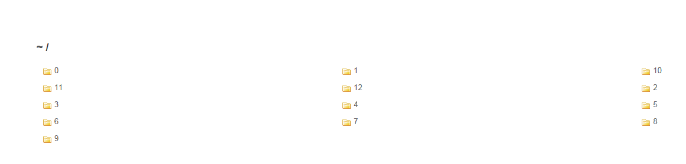
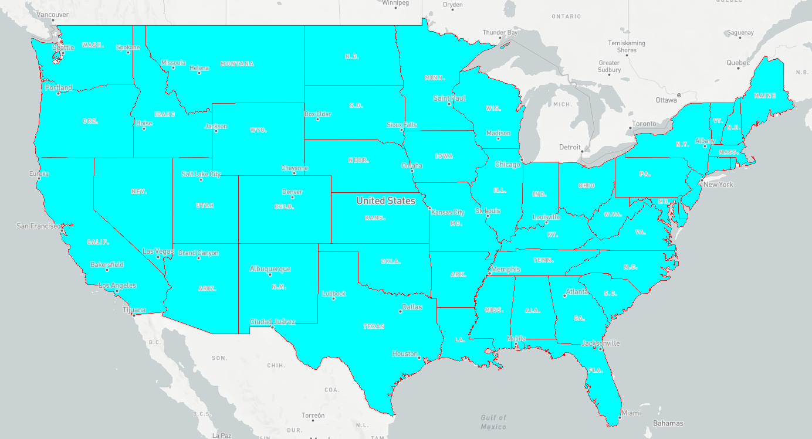

# mapbox 本地切片的制作和访问 

## 0. geojson文件
   从shapefile文件生成geojson文件有多种方法，本人使用过的有：
### 0.1 Shapefile Viewer
   Shapefile Viewer是 Ginkgoch 提供的一个实用程序，可以免费查看 Shapefile 文件的几何和属性,可以到处Geojson文件。
    
    
### 0.2 Geojson.io 
 一个在线的Geojson导入工具网站：
    [Geojson](http://www.geojson.io)

### 0.3 ogr2ogr :
 GDAL的一个实用工具，可以进行多种gis数据转换，用法：

     ogr2ogr -f "file_format" destination_data source_data

  从shp转换geojson，例如：

     ogr2ogr.exe -f "Geojson" states.geojson states.shp

## 1. 使用 tippecanoe 制作mbtiles 数据库
 
    用法
        $ tippecanoe -o us_states.mbtiles us_states.json -zg

还可以使用[MapTiler](https://www.maptiler.com/download/)工具生成mbTiles，界面工具，操作简单

## 2. 生成pbf
   使用 mbutil 从mbTiles中获取 bpf片 [也可以直接使用tippecanoe 导出pbf本地数据]
    MBUtiles is an utility in Rust, to generate MBTiles from tiles directories and extract tiles from MBTiles file.

reference [MBUtil实现mbtiles文件和地图切片之间的格式转换](https://blog.csdn.net/weixin_34384681/article/details/88319605)

## 3. 解压pbf
由于mapbox只能加载未压缩的pbf格式数据，但直使用tippecanoe或mbuitl生成的pbf是经过gzip压缩的数据[不执行解压缩，mapbox加载数据会报："Unimplemented type: 3" 错误]，所以需要解压缩，可以通过py脚本执行解压工作

```bat
    UnGzip_pbf.py 源路径[压缩pbf路径] 目标路径[解压路径] 扩展名[默认扔使用pbf格式，也可改为mvt]

```

## 4. 安装nodejs的 anywhere服务器
``` bash
    npm i anywhere -g 
```

## 5. 将解压后的目录通过anywhere建立文件服务



## 6. 编写mapbox代码
参考mabox例子[Add a vector tile source](https://docs.mapbox.com/mapbox-gl-js/example/vector-source/)
主要设置正确的切片路径,主要代码：
```javascript
  map.on('load', function() {
            map.addLayer({
                "id": "states",
                "type": "fill",
                //"scheme": "zxy",
                "source": {
                    "type": "vector",
                    "tiles": ["http://192.168.1.230:8000/{z}/{x}/{y}.pbf"],
                    "minzoom": 3,
                    "maxzoom": 13
                },
                "source-layer": "us_states",

                "paint": {
                    "fill-color": "#00ffff",
                    "fill-outline-color": "#ff0000"
                }
            }, 'states');
        });
```




## 附录：
### A. 使用 tippecanoe 制作数据库
1. 安装好tippecanoe后，执行如下命令，生成mbtiles数据库：

         用法
        $ tippecanoe -o us_states.mbtiles us_states.json -zg  
    
2. 使用tippecanoe 直接生成缓存目录的pbf：

        $ tippecanoe us_states.json -e us_stats_tileset -zg

3. 具体参数说明：

         用法
        $ tippecanoe -o file.mbtiles [file.json ...]
        
        如果没有指定GeoJSON文件，它将会从标准输入读取。 
        如果指定了多个文件，每个文件都会创建一个对应的图层。

        选项
        tippecanoe提供了众多选项。大多数时候不需要指定额外的选项参数，只需要通过 -o output.mbtiles 指定输出文件名，或者 -f 来删除已经存在的文件。

        如果你不确定所使用数据的最大级别，可以使用 -zg 来根据数据密度自动估算一个级别。

        如果你的数据包含点状要素，通常需要使用-Bg来自动计算一个基准级别做数据抽稀。如果这种方式对你无效，可以尝试使用-r1 --drop-fraction-as-needed 关闭传统的抽稀方法，而仅仅在瓦片太大时才做抽稀。

        如果你的数据包含点状要素或面状要素，你可能需要使用--drop-densest-as-needed 来舍弃一些要素，让其可以在低级别显示。

        如果你的数据包含大量的属性信息，可以使用-y 来指定你需要的属性。

        瓦片输出
        -o file.mbtiles 或者 --output=file.mbtiles： 指定输出文件名称
        -e directory 或者 --output-to-directory=directory： 将瓦片文件输出到指定的directory 文件夹，而不是mbtiles
        -f 或者 --force： 如果指定的mbtiles已存在，则删除，否则抛出错误
        -F 或者 --allow-existing： 忽略元数据或瓦片已存在的情况，一般不推荐使用
        瓦片描述和权属信息
        -n name 或者 --name=name：瓦片集的名称
        -A text 或者 --attribution=text：使用瓦片数据时，显示在地图上的权属信息 (HTML格式)
        -N description 或者 --description=description： 瓦片集的描述信息 (默认 file.mbtiles)
        输入文件和图层名
        name.json 或者 name.geojson： 读取指定的文件到一个名为name的图层
        -l name 或者 --layer=name：使用指定的图层名，如果输入的有多个文件，则这些文件将会被合并到一个图层
        -L name:file.json 或者 --named-layer=name:file.json： 为每一个单独的文件指定一个图层名
        输入文件的并行处理
        -P 或者 --read-parallel: 使用多线程读取一个文件的不同部分 
        该选项只对新行分隔（每个要素为一行）的json文件有效。否则将会返回一个“EOF”错误。
        输入文件的投影
        -s projection 或者 --projection=projection：为输入的数据指定一个投影。目前仅支持 EPSG:4326 (WGS84, 默认) 和 EPSG:3857 (Web墨卡托)。
        缩放级别
        -z zoom 或者 --maximum-zoom=zoom：切片的最大级别（默认14）
        -zg 或者 --maximum-zoom=g： 根据要素分布自动估算最大级别
        -Z zoom 或者 --minimum-zoom=zoom：切片的最小级别（默认0）

#### reference:
- [tippecanoe](https://blog.csdn.net/wan_yanyan528/article/details/70226123)

### B. 安装、编译 tippecanoe
[windows安装tippecanoe并生成mbtiles](https://blog.csdn.net/weixin_42655593/article/details/87603044)
### C. 安装、编译 mbutil
1. 下载mbutile：[https://github.com/amarant/mbutiles](https://github.com/amarant/mbutiles)
2. 使用 set_up.py 安装编译py脚本
3. 找到 build\scripts-2.7\mb-util文件，文件即为编译好的py脚本，windows平台需要将其后缀改为.py，即：mb-util.py 
4. 使用工具：

    用法：
            mb-util [options] input output
        
    例如： 
            mb-tuil.py  --image_format=pbf   states.mbtile  pbf_out_dir


     详细使用：

       $ mb-util -h
        Usage: mb-util [options] input output

        Examples:

            Export an mbtiles file to a directory of files:
            $ mb-util world.mbtiles tiles # tiles must not already exist

            Import a directory of tiles into an mbtiles file:
            $ mb-util tiles world.mbtiles # mbtiles file must not already exist

        Options:
        -h, --help            Show this help message and exit
        --scheme=SCHEME       Tiling scheme of the tiles. Default is "xyz" (z/x/y),
                                other options are "tms" which is also z/x/y
                                but uses a flipped y coordinate, and "wms" which replicates
                                the MapServer WMS TileCache directory structure "z/000/000/x/000/000/y.png"''',
                                and "zyx" which is the format vips dzsave --layout google uses.
        --image_format=FORMAT
                                The format of the image tiles, either png, jpg, webp or pbf
        --grid_callback=CALLBACK
                                Option to control JSONP callback for UTFGrid tiles. If
                                grids are not used as JSONP, you can
                                remove callbacks specifying --grid_callback=""
        --do_compression      Do mbtiles compression
        --silent              Dictate whether the operations should run silently


        Export an `mbtiles` file to files on the filesystem:

            mb-util World_Light.mbtiles adirectory


        Import a directory into a `mbtiles` file

            mb-util directory World_Light.mbtiles